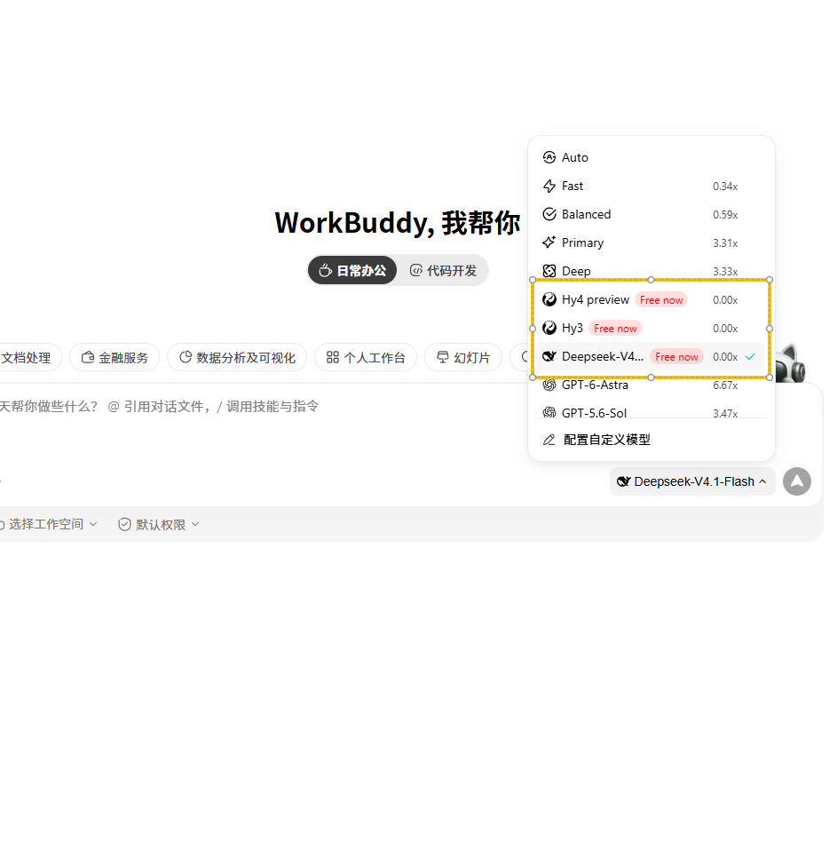

# 免费使用 DeepSeek V4.1 Flash

> 更新时间：2026-09-12
> 状态：有效
>
> [English](/articles/2026-09-12-free-deepseek-v4-1-flash.en.md) | 简体中文

WorkBuddy 的模型列表里，DeepSeek V4.1 Flash 现在标着 **Free now**，计费是 0.00x，也就是不花额度就能直接用。日常的写文案、整理表格、批量改代码这些活，它完全够用。

## 怎么用

1. 打开注册地址，用邮箱或第三方账号注册一个新号：

   [workbuddy.ai](https://workbuddy.ai/invite?code=LBVL7HP3)

2. 登录后进入对话界面，点开输入框上方或右侧的模型选择器。
3. 在列表里找到 **DeepSeek-V4.1-Flash**，右侧显示 `Free now`，选中它。
4. 输入框下方会显示当前模型名，确认无误后就能直接开聊。

同一个列表里的 `Hy4 preview`、`Hy3` 也标了 Free now，都可以顺手试试。

## 小提示

- 免费模型高峰期可能响应偏慢，切换一次模型或稍等片刻通常就好了。
- 长文档总结、代码改写、翻译这类任务，它和付费模型的差距很小。
- 免费状态随时可能调整，趁现在还能白嫖，先注册占个位。
