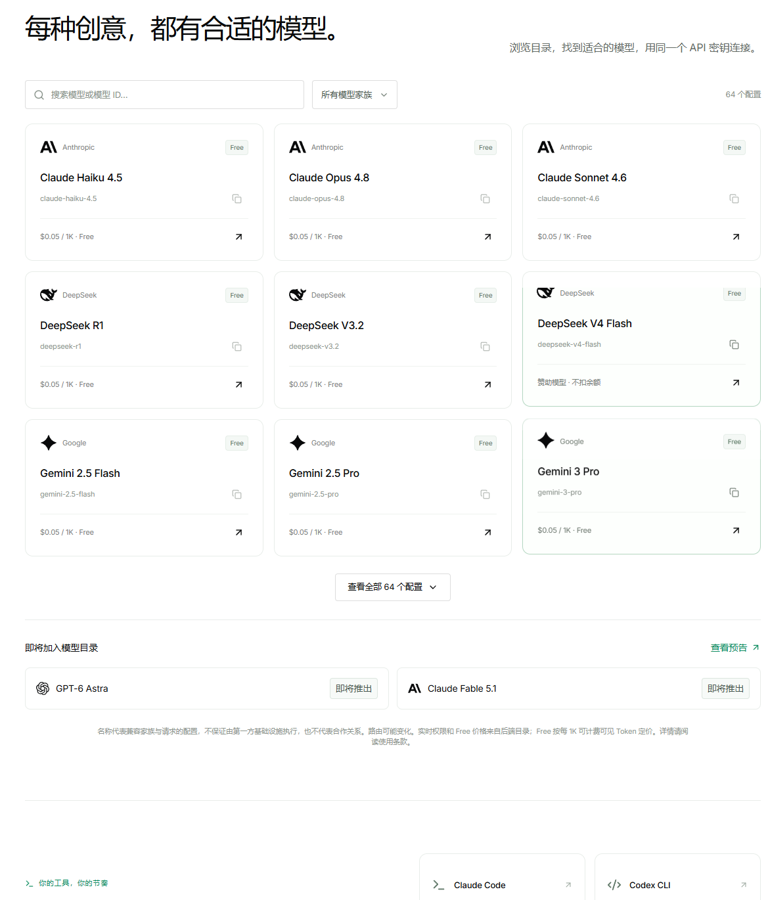
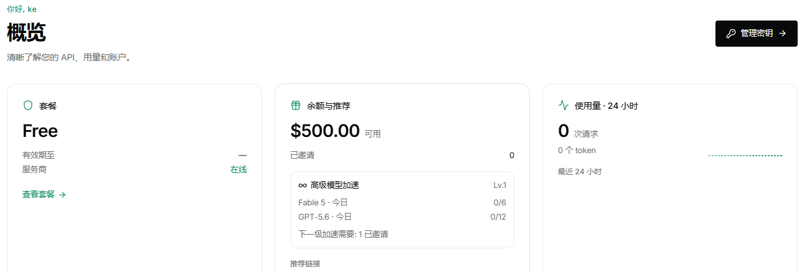

# Conduit：注册直接送 $500，TG 机器人一键开通

> 更新时间：2026-09-13
> 状态：有效
>
> [English](/articles/2026-09-13-conduit-tg-bot-500-bonus.en.md) | 简体中文

Conduit 是个新出的 AI 中转站，开通方式有点特别——直接在 Telegram 机器人里注册，注册成功账户里就直接躺着 **$500 可用额度**，连邮箱验证都不用。

## 模型目录

现在控制台里已经摆出来的模型：

- **Anthropic**：Claude Haiku 4.5、Claude Opus 4.8、Claude Sonnet 4.6
- **DeepSeek**：DeepSeek R1、DeepSeek V3.2、DeepSeek V4 Flash
- **Google**：Gemini 2.5 Flash、Gemini 2.5 Pro、Gemini 3 Pro

底部还挂着两个「即将推出」的大模型：

- **GPT-6 Astra**（OpenAI 系）
- **Claude Fable 5.1**（Anthropic 系）

所有在列模型的费率都是 **`$0.05 / 1K · Free`**，写代码、写文案、长文总结都能直接用。模型选择器一共有 64 个配置，按 ID 或名字搜索就能找到。

## 注册下来账户长啥样

进控制台概览页，能直接看到刚送到的额度：

- **套餐**：Free（有效期至 `---`，服务商在线）
- **余额**：$500.00 可用，已邀请 0
- **高级模型加速 Lv.1**：
  - Fable 5 · 今日 `0/6`
  - GPT-5.6 · 今日 `0/12`
  - 下一级加速需要 1 已邀请
- **使用量 · 24 小时**：0 次请求 / 0 token

高级模型走的是邀请加速通道，邀请 1 位好友后高级模型加速就能升一级，日常自用基本足够。

## 注册流程

唯一前置条件：**准备一个 Telegram 账号**。

1. 在手机上或桌面端登录 Telegram。
2. 直接点下面的链接，系统会自动跳转到 Conduit 官方机器人：

   [t.me/conduitoff_bot](https://t.me/conduitoff_bot?start=ref_7246203821)

3. 在机器人对话里按提示走完注册（绑定 TG 账号即可，无需邮箱）。
4. 拿到 API 密钥后，去控制台 `/dashboard` 就能看到 `$500.00` 余额已到账。

## 怎么用

- 控制台里直接复制 API 密钥，填进 Claude Code、Codex CLI、Cursor 这类客户端的 OpenAI 兼容接口地址就能跑。
- 模型选择器顶端有搜索框，按 ID（`deepseek-r1`、`gemini-3-pro`）或模型名查都行。
- 高峰期响应慢就切换一次模型，或者稍等片刻，常规搭配（DeepSeek + Gemini）不容易排队。
- 余额按 `$0.05 / 1K` 计费，$500 额度日常用一两个月问题不大；高级模型加速有自己的配额，要省着用。

## 小提示

- TG 机器人注册走的是 `start` 邀请参数，确保链接里 `ref_` 后面的数字没被吞掉再点开。
- 控制台套餐标 Free，没有有效期，写完注册就能直接跑模型，没别的隐藏门槛。
- 邀请 1 位好友可以升一级高级模型加速额度，邀请多了还能继续往上推。
